# Moodle con Docker Compose

Guía paso a paso para la instalación y configuración de Moodle utilizando Docker Compose. Este entorno incluye Moodle, MySQL y phpMyAdmin, totalmente integrados y funcionales.

## Requisitos Previos
- [Docker](https://www.docker.com/products/docker-desktop) instalado y en ejecución.
- [Docker Compose](https://docs.docker.com/compose/install/) (viene incluido con Docker Desktop).
- [Git](https://git-scm.com/)

---

## 🚀 1. Instalación y Puesta en Marcha

### Clonar el Repositorio
Abre tu terminal y ejecuta:
```bash
git clone https://github.com/Mich0023/moodle_Docker_Compose.git
cd moodle_Docker_Compose
```

### Credenciales de Base de Datos
El proyecto incluye un archivo `.env` en la raíz con las credenciales necesarias. No es necesario modificarlo para una prueba local, pero es vital tenerlo en cuenta durante la instalación web de Moodle.
```env
MYSQL_ROOT_PASSWORD=mysql-rootpass
MYSQL_DATABASE=moodlelms
MYSQL_USER=moodle-admin
MYSQL_PASSWORD=moodle-dbpass
PMA_PASSWORD=moodle-dbpass
PMA_USER=moodle-admin
```

### Construir y Levantar Contenedores
Ejecuta el siguiente comando para descargar las imágenes, construir Moodle y levantar los servicios en segundo plano:
```bash
docker-compose up -d --build
```
Una vez finalizado, los servicios estarán disponibles en:
- **Moodle**: [http://localhost](http://localhost)
- **phpMyAdmin**: [http://localhost:8081](http://localhost:8081)

---

## ⚙️ 2. Guía de Instalación Web de Moodle

Una vez iniciados los contenedores, abre [http://localhost](http://localhost) en tu navegador y sigue este proceso fotográfico paso a paso.

### Selección de Idioma y Confirmación de Rutas
Selecciona tu idioma preferido para continuar. Luego, mantén los directorios web y los directorios de datos (*moodledata*) tal como el sistema los detecta por defecto.
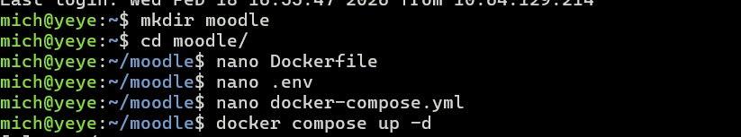
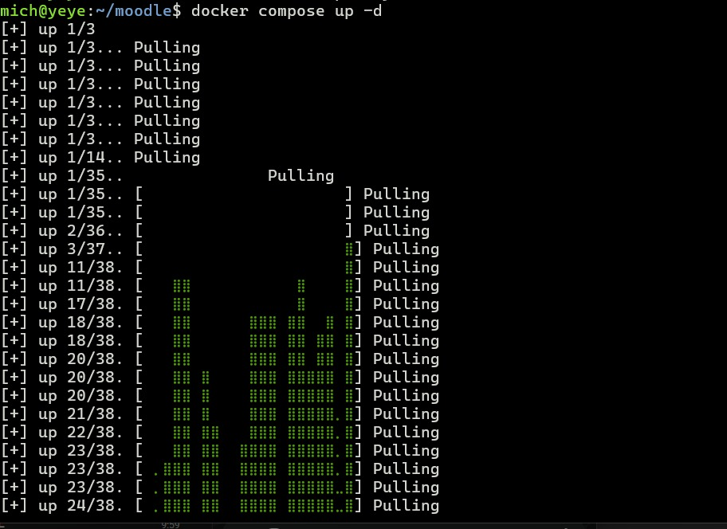
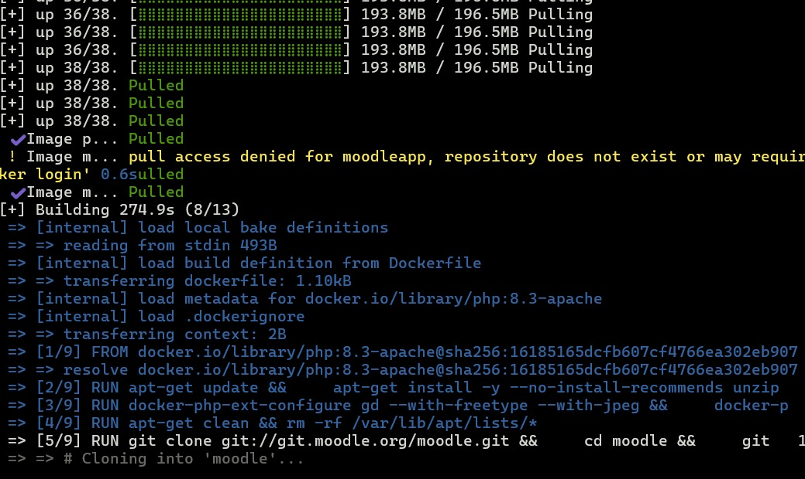

### Configuración de la Base de Datos
Se te solicitará seleccionar el tipo de base de datos. Asegúrate de elegir **MySQL/MariaDB**.
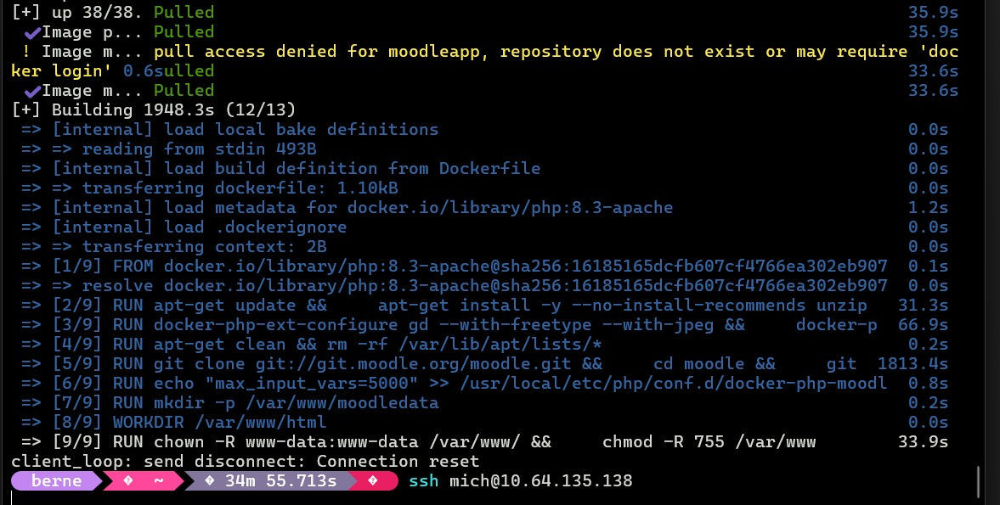
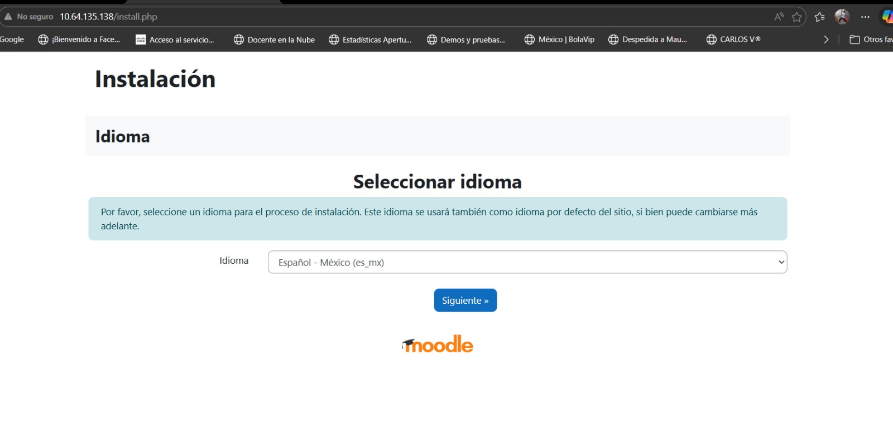

A continuación, enlaza Moodle con el contenedor de la base de datos usando las credenciales del archivo `.env`:
- **Host de la base de datos (Database host)**: `clouddb`
- **Nombre de la base de datos (Database name)**: `moodlelms`
- **Usuario de la base de datos (Database user)**: `moodle-admin`
- **Contraseña (Database password)**: `moodle-dbpass`
- **Puerto de la base de datos (Database port)**: `3306`

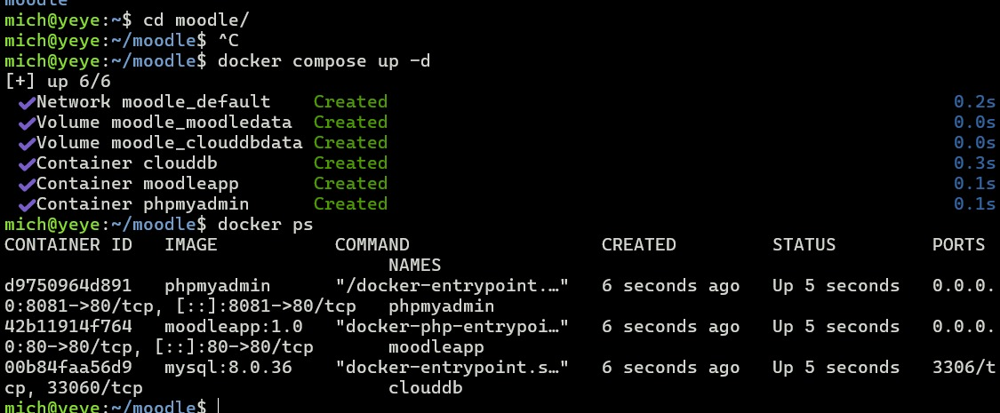
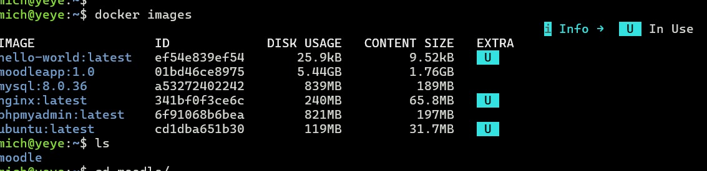

### Verificación del Entorno y Acuerdos
El instalador verificará que el servidor disponga de todas las extensiones PHP requeridas (todas incluidas en el `Dockerfile` de este repo). Confirma las condiciones y presiona "Continuar".
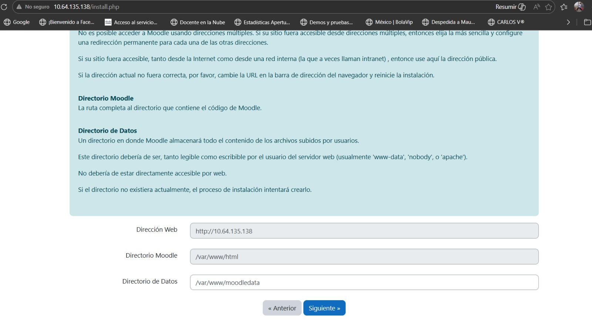
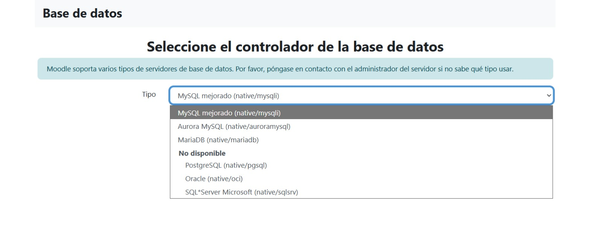
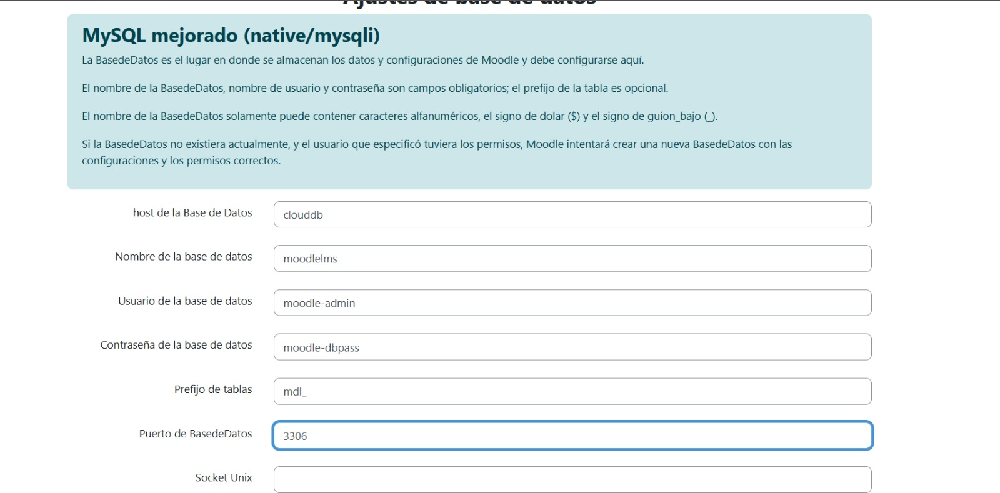

### Instalación de Componentes
El sistema comenzará a procesar la base de datos e instalar todos los módulos internos. Este proceso puede tardar un par de minutos dependiendo de los recursos del sistema. Verás múltiples confirmaciones de "Éxito" a medida que avanza.
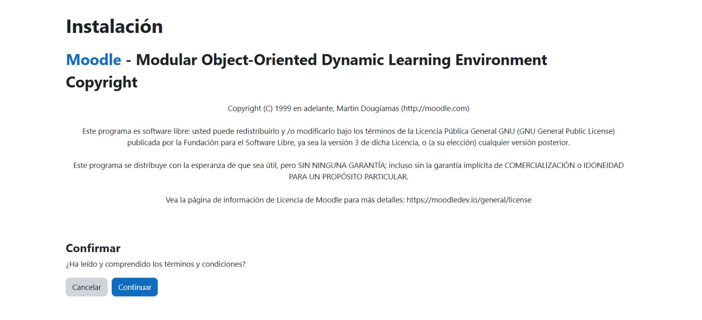
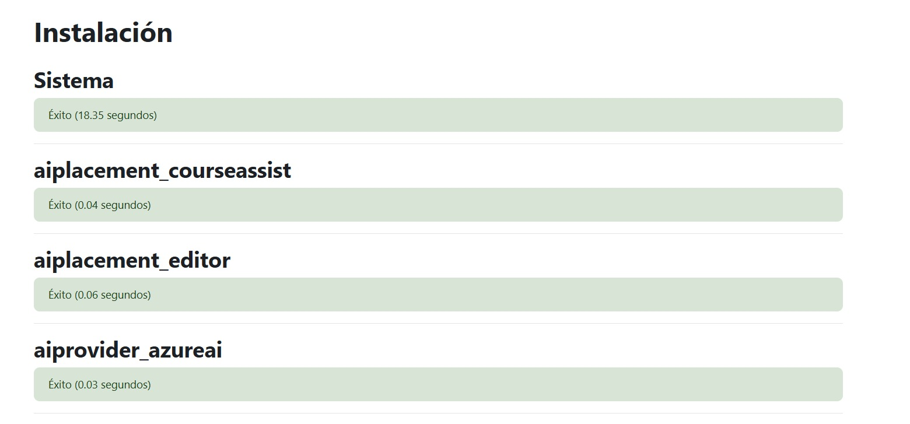
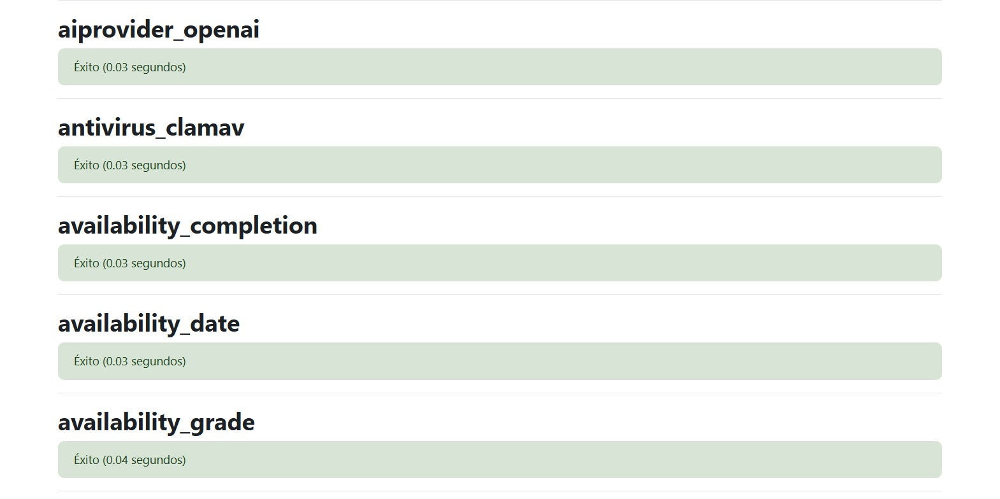
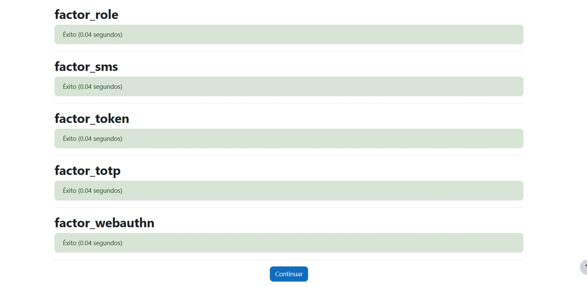

### Configuración del Administrador Principal
Es hora de crear la cuenta administrativa. Completa los campos obligatorios. 
⚠️ **Importante**: Guarda con seguridad el usuario y contraseña que definas aquí, ya que será tu pase de entrada principal al LMS.
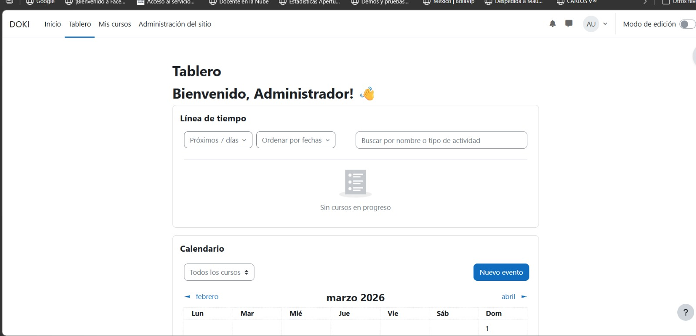
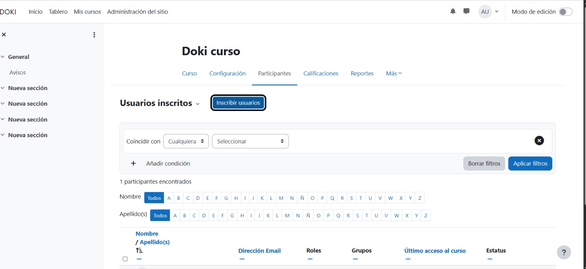
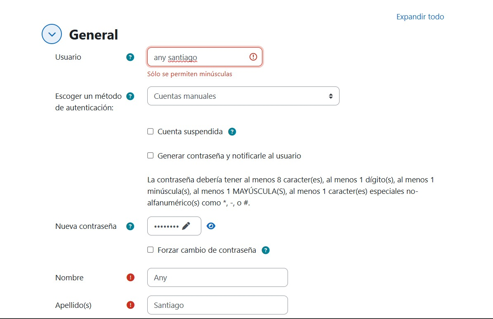

### Ajustes de la Portada
Configura el nombre completo de tu sitio Moodle, el nombre corto y otros ajustes públicos esenciales para tu portal.
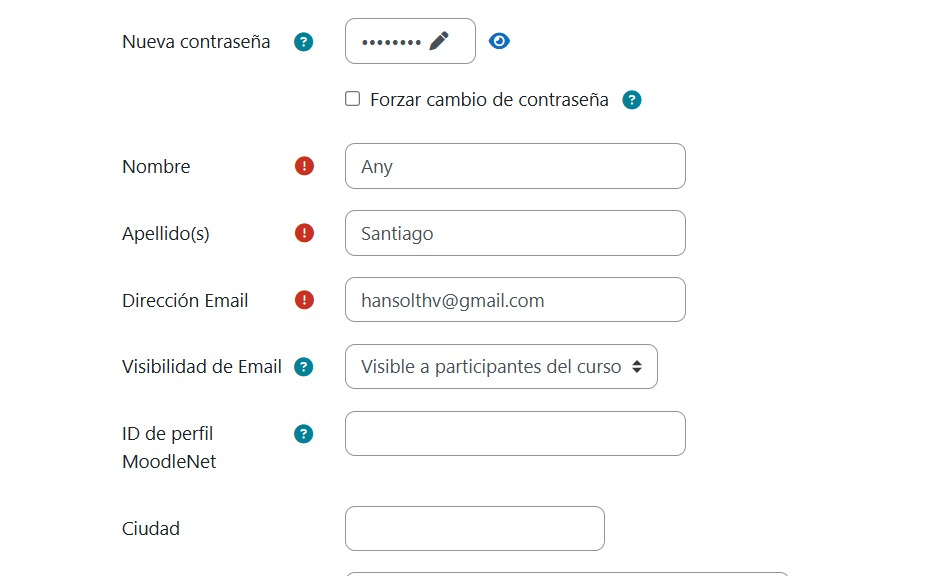
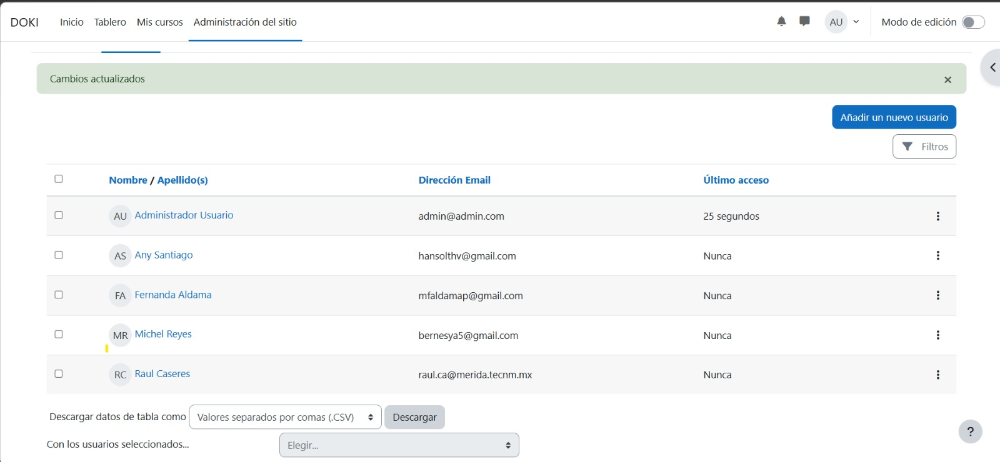

### ¡Finalización!
Una vez guardados los ajustes de portada, serás redirigido al Dashboard o Área Personal de tu nuevo Moodle. 
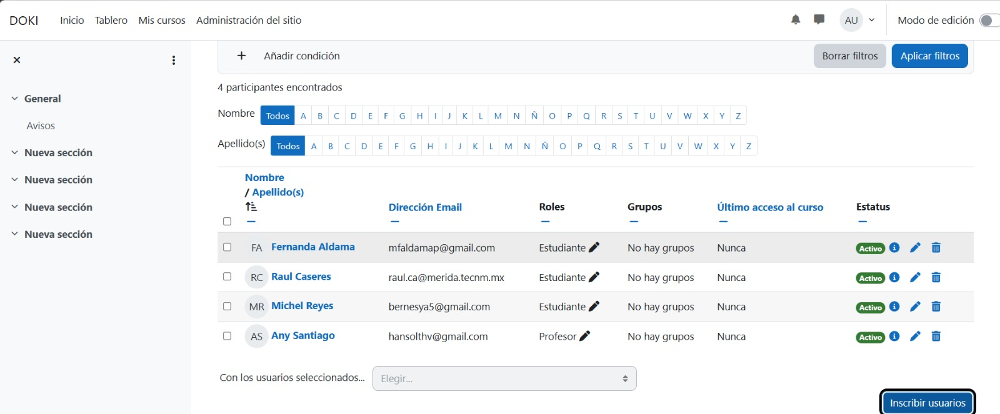

¡Instalación concluida con éxito! 🎉

---
### 🛠️ Administración Adicional
Si necesitas ver y gestionar tus tablas de Moodle directamente, puedes acceder a **phpMyAdmin** navegando a `http://localhost:8081`. 
* **Usuario:** `moodle-admin`
* **Contraseña:** `moodle-dbpass`
